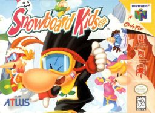

Snowboard Kids
[](https://github.com/cdlewis/snowboardkids-decomp/actions/workflows/build.yaml)
[](https://decomp.dev/cdlewis/snowboardkids-decomp)
[](https://decomp.dev/cdlewis/snowboardkids-decomp)
[](https://discord.gg/DuYH3Fh)
=============



A matching decompilation of [Snowboard Kids](https://en.wikipedia.org/wiki/Snowboard_Kids) for Nintendo 64.

**This repository does not contain any game assets or assembly whatsoever. An existing copy of the game is required. This project is not a port, to PC or any other platform. It takes a Nintendo 64 rom, extracts assets from it, and combines them with C code we reverse-engineered from the rom, to produce an identical rom. It is explicitly a non-goal for this project to be used for any commercial purpose.**

## Cloning

Clone this repository, including its submodules:

```
git clone --recurse-submodules -j8 https://github.com/cdlewis/snowboardkids-decomp.git
```

# Dependencies

This project has been tested on Debian/Ubuntu (x86) and macOS. Your mileage may vary on other systems.

System packages:

* make
* git
* python3
* pip3
* binutils-mips-linux-gnu

On Debian/Ubuntu:
```sh
sudo apt install make git python3 pip3 binutils-mips-linux-gnu
```

On macOS using homebrew. Note that calls below to `make` should use `gmake` instead to run the homebrew version.
```sh
brew install make tehzz/n64-dev/mips64-elf-binutils
```

Build the toolchain:

```bash
make -C tools
```

Install Python dependencies in virtual environment:

```bash
python3 -m venv .venv
source .venv/bin/activate
python3 -m pip install -r requirements.txt
```

## Building

Copy your big-endian Snowboard Kids rom into the root of the repository. Rename it to `snowboardkids.z64`. Then run:

```bash
make clean
make extract
make
```

If everything works correctly you should see:

```bash
build/snowboardkids.z64: OK
```

Contributing
============

Contributions are most welcome! There are a variety of ways you can assist:

* Fix compiler warnings
* Clean up code: you'll see plenty of hastily decompiled functions that use pointer arithmetic rather than proper struct access. We need help cleaning up these functions.
* Document code: some functions/variables have useful names (rather than func_XXX or D_XXX) but most don't. Some that do are incorrectly named. We need lots of help investigating and documenting what all these functions do.
* Support building the project on more platforms such as Windows or ARM Linux. Currently the build is only verified as working on Linux (x86) and macOS which limits who can contribute.

If you have any additional questions, please reach out on Discord (linked in the header). However please note that, since this is a clean room decompilation, we cannot accept contributions based on leaked source code or from those with proprietary knowledge about the game or related subjects.

Acknowledgements
================

This project wouldn't be possible without the collective knowledge, tools, and support of the broader decompilation community. Huge thanks to contributors of other N64 decomp projects, the teams behind [decomp.me](https://decomp.me/) and [decomp.dev](https://decomp.dev/), and the incredibly helpful discussions happening on Discord. These resources have been invaluable for solving problems, speeding up setup, and staying motivated throughout the process.
